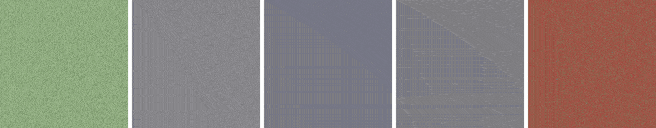

<p align="center">
    <h1 align="center">🦠️ Neural Cellular Automata ⚡️</h1>
    <h3 align="center">Built with PyTorch Lightning</h3>
</p>

<br/>

<p align="center">
    
    
</p>

<br/>

## 🔬 &nbsp;Why?

- PyTorch Lightning implementations are clean
- I wanted to learn about these for fun
- I have some ideas I want to try!

## 🧪 &nbsp;Get Started

1. Clone this repository

2. Install the requirements `pip3 install -r requirements.txt`

3. Run the initial example in `python3.9 nca/example_texture_nca.py` which is a port of the
   simple pytorch example for [Self-Organising Textures](https://distill.pub/selforg/2021/textures/)
   </br></br>
   **Example**
   ```bash
   python3.9 nca/example_texture_nca.py --train_steps=500 run --lr=0.0005
   ```
   
   See all available arguments:

   ```bash
    # General Arguments
    python3.9 nca/example_texture_nca.py --help
    # NCA Arguments
    python3.9 nca/example_texture_nca.py run --help
    ```
